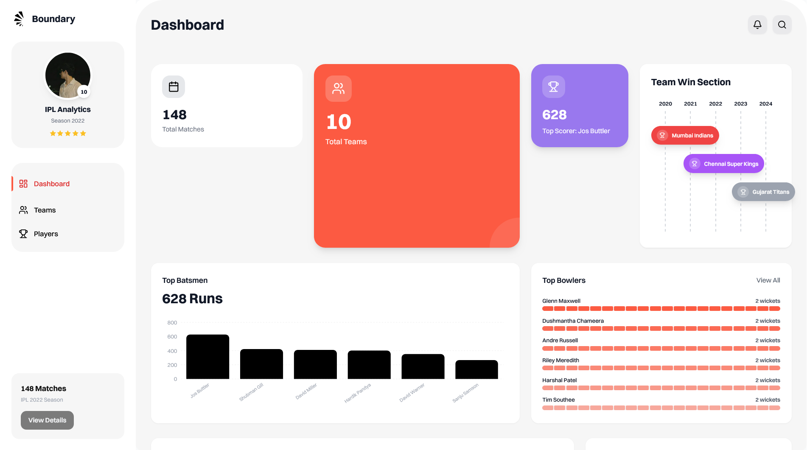

🏏 Boundary Insights – IPL Data Analytics Platform

Boundary Insights is a full-stack web application built to analyze and visualize Indian Premier League (IPL) data.
The project demonstrates end-to-end implementation of database design, backend APIs, frontend analytics dashboards, and cloud deployment.

This project was developed as part of an Internship Assignment to evaluate full-stack engineering fundamentals.

📌 Features

Relational PostgreSQL schema for IPL data

Backend REST APIs with validation and error handling

OpenAPI (Swagger) documentation

Interactive analytics dashboard

Charts and table-based insights

Cloud-deployed backend and frontend

🧠 System Architecture
Frontend (Next.js + Tailwind)
        ↓ REST API
Backend (Node.js + Express + Prisma)
        ↓ ORM
PostgreSQL Database

📂 Dataset

Indian Premier League Dataset
File: Indian_Premier_League_2022-03-26.zip

The dataset includes:

Matches

Teams

Players

Ball-by-ball delivery data

Batting & bowling statistics

The data was analyzed and modeled into a normalized relational schema.

🗄️ Database Design
Tables

Match

Team

Player

Delivery

Season

ORM & Migrations

ORM: Prisma

Schema managed using Prisma migrations

Data loaded using a custom ingestion script

🔧 Backend
Tech Stack

Node.js

Express.js

TypeScript

Prisma ORM

PostgreSQL

Swagger (OpenAPI)

Capabilities

JSON REST APIs

Pagination & filtering

Centralized error handling

Health check endpoint

Swagger UI for API documentation

Key API Endpoints
Method	Endpoint	Description
GET	/api/health	Service health check
GET	/api/matches	List IPL matches
GET	/api/teams	List teams
GET	/api/players	List players
GET	/api/analytics/top-batsmen	Top batsmen by runs
GET	/api/analytics/top-bowlers	Top bowlers by wickets
API Documentation

Swagger UI available at:
👉 <BACKEND_URL>/docs

🎨 Frontend
Tech Stack

Next.js (App Router)

TypeScript

Tailwind CSS

Recharts

Features

KPI summary cards

Analytics charts (bar, line, radial)

Tabular data views

Loading, empty, and error states

Responsive modern UI

Pages

Dashboard

Teams

Players

Analytics

🚀 Deployment
Backend

Platform: Render

URL:
👉 https://bond.hiteshthakur.space

Frontend

Platform: Vercel

URL:
👉 https://bond.hiteshthakur.space

⚙️ Environment Variables
Backend
DATABASE_URL=
PORT=
NODE_ENV=production
CORS_ORIGIN=https://bond.hiteshthakur.space
API_BASE_URL=https://bond.hiteshthakur.space

Frontend
NEXT_PUBLIC_API_BASE_URL=https://bond.hiteshthakur.space

🛠️ Local Setup
Prerequisites

Node.js or Bun

PostgreSQL

Backend Setup
cd backend
bun install
bun run prisma:generate
bun run prisma:migrate
bun run import:ipl
bun run dev

Frontend Setup
cd boundary-insights-frontend
bun install
bun run dev

🧪 Health Check
GET /api/health

Returns service status and timestamp.

📸 Screenshots

Add screenshots of:

Dashboard

Charts

Table views

Swagger UI

🚧 Assumptions & Limitations

Analytics focus on aggregate insights

Emphasis on clarity and correctness over heavy optimization

🌱 Future Enhancements

Player comparison views

Advanced filters

Caching and performance tuning

Authentication & role-based access

Docker & CI/CD pipelines

👤 Author

Hitesh Thakur
